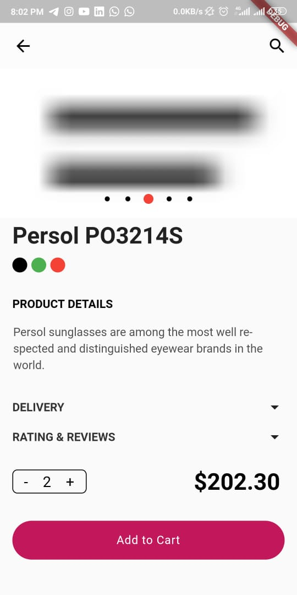

# flutter_ui_7_buying_frames

This is another Flutter UI which i created.
**About the UI**:- 
This is a UI based on an online store basically for showcasing products to users and delivering an easy solution of buying them with their phone.
 
There 3 screens in total in this UI.When you open the app you will be on the first screen which has an image as it's background with a widget at the bottom of the screen covering half the width of the screen which has a Gesture detector for taking us on the next screen wen tapped on. 
When we are on the next screen this has a menubar display for navigation withing the app. Apart for them a search icon for searching through the product.(Not funtional yet) It also has a Tabbar with 5 tabs for displaying products according to their respective categories. For now i have kept the same things undr each tab.This tab bar has a list view which will be displaying the products belonging to that particular category. This Widget used in this is child of gesture controller which will open the next screen.
This is the last screen within our app which is the product description screen used for showing the particular product in detail. It has a carousal with the help of which we can view different images of the same product to get a better perspective about that particular product.Below this we have product name and colour options and some more widgets(Not functional yet) which are there to perform their features accordingly. 
This UI was made by someone on Dribble. 
Things done in this app involve:- 
* TabBar
* Carousel
* Gesture Detector
* Statful widgets
* Multiple screens.
___
Built in:-
* Flutter
___
Some snaps from the UI:-
* Full video:- 
* Original UI:-

* My UI:- 

## Getting Started

This project is a starting point for a Flutter application.

A few resources to get you started if this is your first Flutter project:

- [Lab: Write your first Flutter app](https://flutter.dev/docs/get-started/codelab)
- [Cookbook: Useful Flutter samples](https://flutter.dev/docs/cookbook)

For help getting started with Flutter, view our
[online documentation](https://flutter.dev/docs), which offers tutorials,
samples, guidance on mobile development, and a full API reference.
